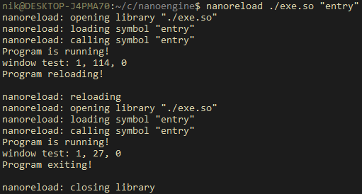

# nanoreload
A tiny library reloader program written in C99.

`nanoreload [library file] (entry symbol) (debug?)`

Currently the "API" is

- if the entry symbol returns 1, it is reloaded
- otherwise, nanoreload exits
